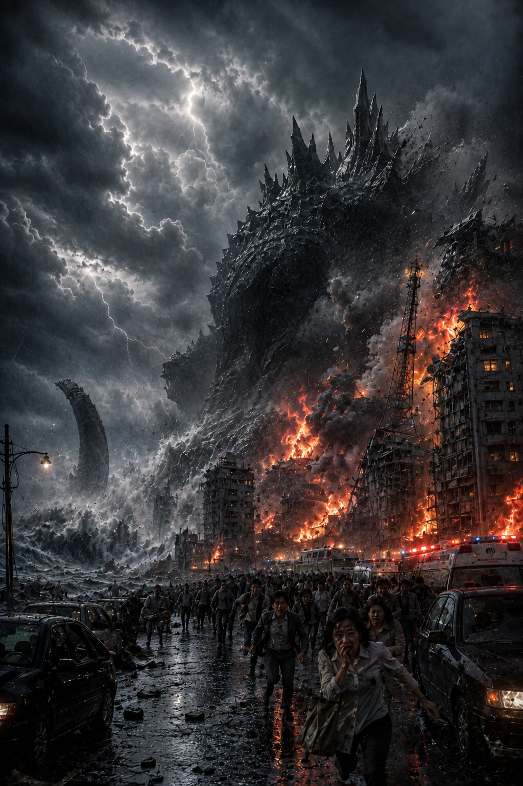

# RICHIAMO

### Giappone, novembre 1986 — un'avventura fuori dal normale per GENKAI 限界

---

**玄海新報 — GENKAI SHIMPŌ**
*Gōgai · edizione straordinaria · giovedì 6 novembre 1986 · distribuzione gratuita*

## LA CENTRALE NON C'È PIÙ

*Il gigante venuto dal mare ha attraversato l'impianto nucleare all'alba, poi il mare se l'è ripreso. La nube sale ancora. Nessuno sa dove riemergerà.*

GENKAI — È uscito dal mare ieri mattina alle 6 e 51, con la prima luce, davanti alle rive della centrale. Alto centoventi metri: la torre del castello di Karatsu gli arriva al ginocchio. Non ha ruggito. Non ha attaccato nessuno. Ha semplicemente camminato — e la centrale era sulla sua strada.

Le due cupole si sono aperte come gusci. Dei quarantatré uomini del turno di notte, ventidue non rispondono all'appello. La prefettura ha ordinato l'evacuazione di Genkai, Chinzei, Yobuko e dei quartieri ovest di Karatsu. Il vento, per ora, spinge la nube verso il largo. Per ora.

Sette mesi dopo Černobyl', la parola che nessuno voleva più stampare è tornata sulle nostre coste. Ma questo giornale stanotte ne stampa un'altra: **lo sapevano**. I pescatori di Madara-shima lo dicevano da giorni — le reti tranciate, il solco sul fondale, il rombo che faceva tremare le case nelle notti. Qualcuno, su quel rapporto, ha scritto «panico ingiustificato». Vogliamo i nomi.

È rimasto a terra il tempo di attraversare il promontorio: entrato dall'acqua a ponente, uscito nell'acqua a levante — e nel mezzo non è rimasto niente. Le motovedette l'hanno seguito al largo, rotta nord-est, poi più niente: sparito. A quest'ora potrebbe essere ovunque, sotto il Mar del Giappone.

I pescatori hanno una parola per il suono che faceva di notte: *uminari*. Il rombo del mare. Da ieri è il suo nome.

«Non è arrabbiato», ha detto un vecchio di Madara guardando il fumo, facendosi il segno della croce. «Sta rispondendo a qualcosa.»

---

**GENKAI — RICHIAMO** · Giappone, novembre 1986 · si gioca.
