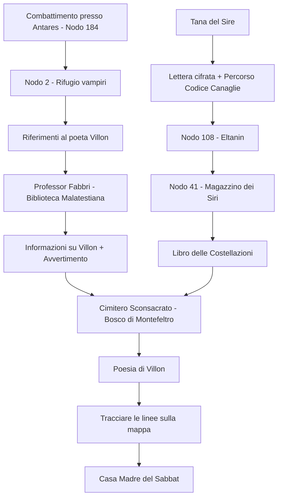

# 🦇 Indizi per la Casa Madre del Sabbat

> [!info] Riepilogo Questa nota raccoglie tutti gli indizi che i PG devono seguire per trovare la Casa Madre del Sabbat, nascosta sotto i cunicoli di Santarcangelo. La chiave è la **poesia di Étienne Villon** che indica quattro stelle da collegare sulla mappa del labirinto.

---

## 📍 Mappa degli Indizi



---

## 1️⃣ Combattimento presso Antares (Nodo 184)

### Evento

Durante le investigazioni, i PG si imbattono **casualmente** in un gruppo di vampiri nei pressi del nodo 184 (Antares). Dopo il combattimento, i vampiri sopravvissuti si rifugiano nel **nodo 2**.

### Cosa trovano al Nodo 2

#### Percorso in Codice delle Canaglie

Un foglio macchiato di sangue con simboli del Codice:

```
184 (Antares) → 2
```

#### Vecchi libri e documenti

Tra le cianfrusaglie, trovano:

- Libri ammuffiti di occultismo minore
- Un diario frammentario con annotazioni
- **Un riferimento chiave**: _"...il folle Villon credeva di aver trovato la via. Ha scritto tutto prima di morire, nella tomba dove l'hanno gettato come un cane..."_

#### Annotazione sul poeta

In un margine di un libro, con grafia nervosa:

> _"La poesia è nella sua tomba. Nessuno l'ha mai trovata. Nessuno che sia tornato."_

---

## 2️⃣ Tana del Sire

### La Lettera Cifrata

I PG trovano una lettera piegata in quattro, scritta con inchiostro sbiadito. Non è indirizzata a nessuno.

> [!quote] Testo della Lettera _"Fratello,_
> 
> _la via è aperta per chi sa leggere le pietre. Parti dalla vecchia Pieve dove il santo guerriero veglia da prima che i Malatesta costruissero le loro torri. Scendi dove le monache non hanno mai pregato, dove il buio è più antico della fede._
> 
> _Il cammino è segnato. L'occhio del serpente ti guiderà fino al deposito._
> 
> _Non portare luce. Non portare speranza._
> 
> _— V."_

### Decodifica (per il DM)

- **"vecchia Pieve dove il santo guerriero veglia"** = Pieve di San Michele Arcangelo (VI secolo)
- **"prima che i Malatesta costruissero"** = conferma l'antichità (bizantina)
- **"dove le monache non hanno mai pregato"** = le grotte sotto, non luoghi sacri
- **"L'occhio del serpente"** = Eltanin (nodo 108)
- **"V."** = firma volutamente ambigua (Villon? Un altro?)

### Percorso in Codice delle Canaglie

Allegato alla lettera, un foglio separato con i simboli:

```
108 (Eltanin) → 41
```

---

## 3️⃣ Ingresso del Labirinto — Pieve di San Michele Arcangelo

### Descrizione del Luogo

> [!note] Per il DM La Pieve di San Michele Arcangelo si trova a circa 1 km a sud del centro di Santarcangelo. È uno degli edifici religiosi più antichi della Romagna, risalente al **VI secolo** (epoca bizantina).

**Esterno:** La pieve sorge isolata, circondata da campi e qualche cipresso. La facciata in mattoni sottili è **obliqua**, con il campanile che si erge al centro — alla sua base si apre l'ingresso principale. Di notte, il luogo ha un'atmosfera sospesa nel tempo, lontano dalle luci del paese.

**Interno:** Navata unica, spoglia e severa. Resti di pavimento musivo romano, un cippo di pietra scolpito che funge da altare, tracce sbiadite di un affresco di San Sebastiano. L'aria è fredda anche d'estate.

**La Botola:** Dietro l'altare, nascosta da una lastra di pietra consumata, si trova una botola. Le pietre intorno mostrano segni di usura — qualcuno l'ha aperta molte volte nel corso dei secoli.

La botola scende in una delle **grotte tufacee** che perforano il Colle Giove — circa 150 ipogei collegati da cunicoli per 5-6 km. Ma questo ingresso porta più in profondità, dove le grotte diventano qualcos'altro.

### Come i Siri descriverebbero il luogo

> _"La vecchia chiesa del santo con la spada. Quella fuori dal paese, dove non va più nessuno. C'è una pietra dietro l'altare che si muove. Sotto, il buio puzza di terra bagnata e di qualcosa di più vecchio. Non andare da solo."_

---

## 4️⃣ Nodo 41 — Magazzino dei Siri

### Descrizione

Una cavità naturale allargata, con pareti di tufo umido. Casse di legno marcio, barili, scaffali improvvisati. Odore di muffa e qualcosa di metallico — sangue vecchio.

### Cosa trovano

#### Risorse

- Armi bianche arrugginite (utilizzabili in emergenza)
- Sacche di vitae conservato (2-3 dosi, qualità dubbia)
- Vestiti di ricambio, alcuni macchiati
- Denaro contante (somme modeste)

#### Il Libro delle Costellazioni

Un volume rilegato in pelle scura, **"Theatrum Cœli"** (Teatro del Cielo), stampato nel 1623. Le pagine sono ingiallite ma leggibili. Contiene:

- Mappe stellari dettagliate delle costellazioni visibili dall'emisfero nord
- Illustrazioni di **Corvus, Scorpius, Orion e Draco**
- Tabelle con i nomi delle stelle principali

#### Annotazioni nel libro

Sparse tra le pagine, con grafie diverse e inchiostri di epoche differenti:

> _"I cunicoli sotto queste terre ricalcano il cielo. Chi conosce le stelle, conosce la via."_ — (grafia antica, forse XVII secolo)

> _"Minkar, Lesath, Bellatrix, Eltanin — le quattro porte. Ma quale porta apre cosa?"_ — (grafia più recente, forse XIX secolo)

> _"Questi cunicoli puzzano di merda e di morte. Gli immortali sono bestie che vivono nel fango."_ — (grafia moderna, sprezzante)

> _"Mai trovato niente di utile qui sotto. Solo topi e ossa. Il 'grande segreto' è una cazzo di favola per neonati."_ — (stessa mano della precedente)

#### Note per il DM

Le annotazioni sprezzanti sono dei **siri** — umani che servono i vampiri ma li disprezzano. Usavano il libro per orientarsi, senza capirne il vero significato. Il loro cinismo può fuorviare i PG o, al contrario, spingerli a cercare più a fondo.

---

## 5️⃣ L'Esperto — Professor Ludovico Fabbri

### Chi è

**Nome:** Professor Ludovico Fabbri **Età:** 72 anni **Professione:** Paleografo e archivista emerito **Sede:** Biblioteca Malatestiana di Cesena (a circa 20 km da Santarcangelo)

### Descrizione

Un uomo magro, con occhiali spessi e mani macchiate d'inchiostro. Veste sempre in tweed consumato. Parla lentamente, scegliendo ogni parola. I suoi occhi tradiscono una conoscenza di cose che preferisce non nominare.

La Biblioteca Malatestiana è **patrimonio UNESCO** — la prima biblioteca civica d'Europa (1452). Il professor Fabbri ne custodisce i segreti da quarant'anni.

### Quando lo consultano

I PG possono cercarlo per:

1. **Decifrare il Codice delle Canaglie** (se non riescono da soli)
2. **Informazioni sul poeta Étienne Villon**
3. **Capire le annotazioni nel libro delle costellazioni**

### Cosa rivela

#### Sul Codice delle Canaglie

> _"Ah, il Codice delle Canaglie. Lo chiamavano così i vagabondi tedeschi, i Landstreicher. Segni per indicare rifugi, pericoli, elemosina. Ma questo... questo è più antico. E più specifico. Qualcuno l'ha adattato per i cunicoli sotto Santarcangelo."_

#### Su Étienne Villon

> _"Villon... un nome maledetto. Un poeta francese, arrivato in Romagna nel 1340, forse in fuga da qualcosa. Cercava... beh, cercava l'immortalità. Non quella dei versi, capite. Quella vera."_
> 
> _"Lo trovarono morto nel 1347, dissanguato, nella sua tenuta vicino a Santarcangelo. La famiglia — i Villon avevano sposato una casata locale, i Da Vico — lo fece seppellire in fretta. In terra sconsacrata, su in montagna, nel Montefeltro. Dicevano che avesse visto qualcosa che non doveva vedere."_
> 
> _"Prima di morire, scrisse una poesia. L'ultima. Dicono che sia incisa sulla sua tomba, o nascosta nella cripta. Nessuno l'ha mai verificato... o almeno, nessuno che sia tornato a raccontarlo."_

#### L'Avvertimento

> _"Ascoltate bene. Ho studiato questi cunicoli per trent'anni. Conosco ogni mappa, ogni documento, ogni leggenda. E vi dico questo: **nessun percorso conosciuto porta in quel luogo**. Il luogo che cercate non esiste sulle mappe."_
> 
> _"I pochi che dicono di averlo trovato... non sono più tornati. O sono tornati **diversi**. Cambiati. Vuoti."_
> 
> _"Se proprio dovete andare, non fidatevi delle mappe. Fidatevi delle stelle."_

#### Dove trovare la tomba

> _"Il cimitero della famiglia Villon-Da Vico... è abbandonato da secoli. Si trova nei boschi sopra il passo di Viamaggio, nel Montefeltro. Territorio difficile. E non solo per le strade."_
> 
> _"Quella zona... appartiene ad altri. Gente che non ama i visitatori. Portatevi qualcosa da offrire."_

---

## 6️⃣ Il Totem per i Licantropi

> [!warning] Collegamento con la Prima Avventura Per raggiungere il cimitero, i PG devono attraversare territorio dei **Licantropi**. Hanno bisogno di un **dono/totem** per ottenere il permesso di passaggio.

### La Custode Agnese

I PG hanno incontrato **Agnese** nella prima avventura. È la **ex-ghoul del custode del Palazzo del Bargello di Pennabilli** — una donna anziana che conosce i confini tra i mondi.

Agnese può fornire (o indicare dove trovare) un **totem appropriato** per i Licantropi:

- Un oggetto antico legato alla terra
- Un tributo di sangue o caccia
- Una promessa vincolante

> [!note] Da sviluppare L'incontro con i Licantropi sarà trattato in una nota separata. Qui basta sapere che il totem è necessario per l'accesso.

---

## 7️⃣ Il Cimitero Sconsacrato — Tomba di Villon

### Posizione

**Montefeltro — Boschi sopra il Passo di Viamaggio** Provincia di Rimini, al confine con le Marche e la Toscana.

Un luogo dove le strade asfaltate finiscono e i sentieri si perdono tra faggi e querce secolari. L'aria è diversa qui — più pesante, più antica.

### Descrizione del Cimitero

> [!quote] Lettura evocativa Il sentiero si stringe tra gli alberi, poi scompare del tutto. Dovete farvi strada tra felci alte fino alla vita e rami che sembrano afferrare. Poi, all'improvviso, gli alberi si aprono.
> 
> Un muro di pietra crollato delimita un rettangolo di terra dove l'erba cresce più scura. Lapidi inclinate spuntano dal terreno come denti marci. Al centro, un mausoleo — piccolo, quadrato, con un angelo senza testa che veglia sull'ingresso.
> 
> Non ci sono suoni qui. Nemmeno gli uccelli.

### La Tomba di Villon

Il mausoleo della famiglia Villon-Da Vico è il più grande del cimitero. L'angelo decapitato tiene ancora in mano una spada spezzata.

**Esterno:**

- Pietra annerita dal tempo
- Simboli scolpiti quasi cancellati (si riconoscono stelle, serpenti, un corvo)
- La porta di ferro è socchiusa — qualcuno l'ha aperta molto tempo fa

**Interno:**

- Una scala scende nella cripta
- Nicchie con bare di legno marcito
- Al centro, un sarcofago di pietra con il nome **ÉTIENNE VILLON** e le date **1298-1347**

**La Poesia:** Incisa sulla parete dietro il sarcofago, ancora leggibile nonostante i secoli. Le lettere sono state tracciate con cura maniacale, probabilmente dallo stesso Villon prima di morire.

---

## 8️⃣ La Poesia di Étienne Villon

### Ultimo Canto di Étienne Villon

_(ritrovato inciso nella Cripta della famiglia Villon-Da Vico, 1347)_

> _Io muoio, e scrivo col mio stesso sangue,_ _Ché l'inchiostro è finito e il corpo langue._ _Ho visto il Corvo, l'ho seguito nel buio—_ _Il suo becco tracciava il primo solco._
> 
> _Fratello, sorella, chi trova questo foglio,_ _Non sono pazzo, non è questo un imbroglio!_ _Ho camminato scalzo tra i sepolcri,_ _Ho dato il pane ai vermi e agli insepolti._
> 
> _Cercate dove l'Amazzone riposa_ _Sulla spalla del Cacciatore, sposa_ _Di guerra e stelle, fredda sentinella—_ _E tracciate la linea dalla più bella._
> 
> _Il Drago! Il Drago mi fissa mentre scrivo!_ _Il suo occhio non dorme, ed io ne sono privo_ _Di forze ormai—ma voi, congiungetelo_ _Al dardo dello Scorpione, al suo flagello._
> 
> _Due linee, e dove s'incrociano nel nero,_ _Là giace il trono, là giace il mistero._ _Là scesi, là vidi, là persi il mio nome—_ _Là siede il Padre, corona di cenere e fame._
> 
> _Non portatevi torce, non vi servono affatto._ _Portatevi la sete. Quello è il patto._ _Chi legge, segua. Chi teme, bruci il foglio._ _Io scendo lieto nel mio ultimo soglio._

### Chiave di Decodifica (per il DM)

|Verso|Riferimento|Stella|Costellazione|
|---|---|---|---|
|_"Il suo becco tracciava il primo solco"_|Becco del Corvo|**Minkar**|Corvus|
|_"Al dardo dello Scorpione, al suo flagello"_|Pungiglione dello Scorpione|**Lesath**|Scorpius|
|_"L'Amazzone... sulla spalla del Cacciatore"_|Amazzone/Guerriera su Orione|**Bellatrix**|Orion|
|_"L'occhio del Drago non dorme"_|Occhio del Drago|**Eltanin**|Draco|

### Come risolvere l'enigma

1. I PG devono identificare le quattro stelle nella poesia
2. Trovarle sulla mappa del labirinto (usando il libro delle costellazioni)
3. Tracciare **due linee**:
    - **Minkar → Lesath** (Corvo → Scorpione)
    - **Bellatrix → Eltanin** (Amazzone → Drago)
4. **L'incrocio delle due linee** indica la posizione della Casa Madre

---

## 9️⃣ Storia di Étienne Villon

### Origini (1298-1330)

Étienne Villon nasce a Parigi nel 1298, figlio cadetto di una famiglia di mercanti. Fin da giovane mostra talento per la poesia e un'ossessione per la morte — o meglio, per sconfiggerla.

Studia alla Sorbona, dove entra in contatto con testi proibiti: alchimia, necromanzia, leggende sui vampiri dell'Europa orientale. Viene espulso nel 1325 per "pratiche contrarie alla fede".

### L'Arrivo in Romagna (1340)

Dopo anni di vagabondaggio, Villon arriva in Romagna seguendo voci su "immortali che camminano nella notte". Sposa **Lucia Da Vico**, figlia di una famiglia nobile decaduta, che possiede terre nel Montefeltro.

Si stabilisce vicino a Santarcangelo, dove scopre i cunicoli sotto il Colle Giove. Comincia a esplorare, a mappare, a cercare.

### La Ricerca (1340-1346)

Villon è convinto che nei cunicoli si nasconda qualcosa di antico — qualcuno che ha sconfitto la morte. Scrive nei suoi diari:

> _"Li ho visti, i Signori della Notte. Bevono sangue come noi beviamo vino. Non invecchiano. Non muoiono. Devo trovare il modo di unirmi a loro."_

Passa anni a cercare di attirare la loro attenzione. Lascia offerte di sangue nei cunicoli. Scrive poesie che glorificano l'oscurità. Si fa sempre più emaciato, sempre più folle.

### Il Contatto (1346)

Finalmente, qualcuno risponde. Villon viene portato in un luogo che non compare su nessuna mappa — la Casa Madre. Là vede il "Padre" e il suo "trono di ossa".

Ma qualcosa va storto. Villon non viene trasformato. Forse non è ritenuto degno. Forse è solo un giocattolo. Viene rigettato, con la mente spezzata e il corpo segnato.

### La Morte (1347)

Villon torna alla sua tenuta, ormai un relitto. Sa che morirà presto — gli hanno preso troppo sangue, troppe volte. Ma prima di morire, vuole lasciare un messaggio.

Scrive la sua ultima poesia, incidendola nella cripta di famiglia. Poi si taglia le vene e usa il suo sangue come inchiostro per completare l'opera.

Lo trovano la mattina dopo, dissanguato, con un sorriso sul volto.

La famiglia, terrorizzata e vergognosa, lo fa seppellire in terra sconsacrata, nel cimitero abbandonato in montagna. Nessun prete officia il funerale. Nessuna preghiera viene detta.

> _"Io scendo lieto nel mio ultimo soglio."_

### Eredità

La poesia di Villon sopravvive perché è incisa nella pietra. Per secoli, pochi l'hanno letta. Ancora meno l'hanno capita. E quasi nessuno ha avuto il coraggio di seguire le istruzioni.

Quelli che l'hanno fatto... non sono tornati. O sono tornati cambiati.

---

## 🔗 Collegamenti

- [[Codice delle Canaglie]]
- [[Mappa del Labirinto]]
- [[Costellazioni - Stelle Chiave]]
- [[Licantropi del Montefeltro]]
- [[Casa Madre del Sabbat]]
- [[Custode Agnese]]
- [[Professor Ludovico Fabbri]]

---

## ✅ Checklist Indizi

- [ ] Combattimento presso Antares → riferimenti a Villon
- [ ] Tana del Sire → lettera cifrata con luogo d'ingresso
- [ ] Percorso Eltanin → Nodo 41
- [ ] Libro delle Costellazioni con annotazioni
- [ ] Consultazione Professor Fabbri
- [ ] Totem dalla Custode Agnese
- [ ] Attraversamento territorio Licantropi
- [ ] Cimitero sconsacrato → Poesia di Villon
- [ ] Decodifica della poesia
- [ ] Tracciamento linee sulla mappa
- [ ] Scoperta della Casa Madre

---

## 📝 Note per il DM

### Difficoltà degli Indizi

Gli indizi sono distribuiti in modo che:

- I PG **devono** trovare almeno due riferimenti al poeta (Nodo 2 + Professor Fabbri)
- Il libro delle costellazioni è **essenziale** per capire la poesia
- La poesia da sola non basta senza la mappa del labirinto

### Ridondanze Intenzionali

- Due vie per scoprire Villon (libri al Nodo 2 + Professor Fabbri)
- Due conferme che le stelle sono sulla mappa (annotazioni nel libro + Professor Fabbri)

### Possibili Blocchi

Se i PG si bloccano:

1. Il Professor Fabbri può dare hint più espliciti
2. Un PNG ostile può lasciarsi sfuggire informazioni
3. Sogni/visioni possono guidarli (elemento soprannaturale)

### Atmosfera

- I cunicoli sono **claustrofobici e antichi**
- Il cimitero è **silenzioso e sbagliato**
- La Casa Madre è **terrificante e maestosa**

Non abbiate paura di far sentire i PG piccoli e vulnerabili. Stanno cercando qualcosa che non avrebbero mai dovuto trovare.